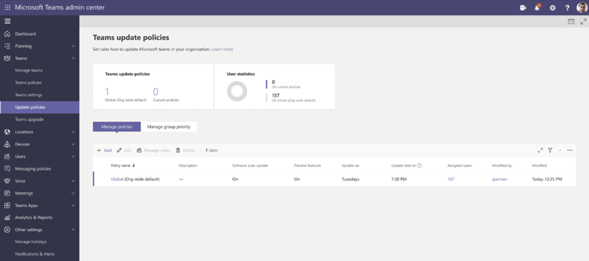
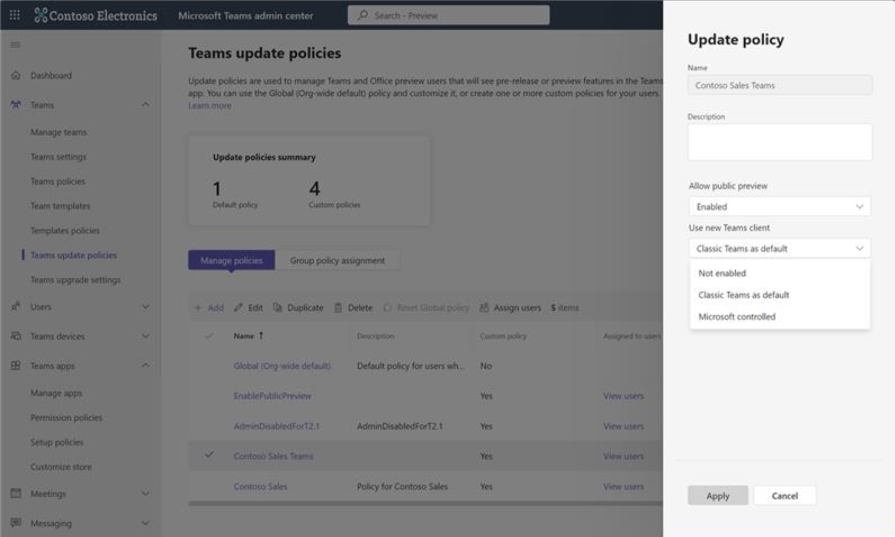
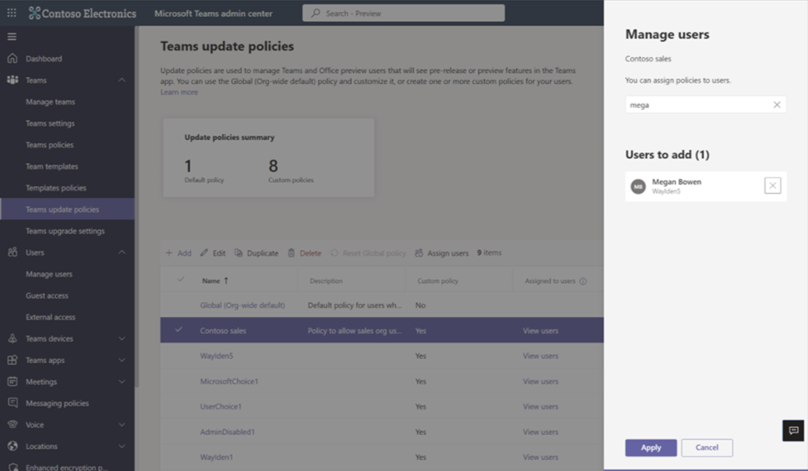
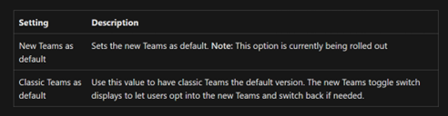

# New Teams迁移须知

New Teams自动迁移将在2024年3月31日后开始。

从当前的Teams（经典Teams 版本），到新Teams的迁移将是自动的。但是，这个变更也需要对客户的情况进行全面评估，并根据其环境和用户设备进行定制化准备。

VDI和Microsoft Teams Room（MTR）以及Surface Hub的设备不受2024年3月31日时间表的影响。从官方文档[Classic Teams users to be automatically updated to new Teams - Microsoft Teams | Microsoft Learn](https://learn.microsoft.com/en-us/microsoftteams/teams-classic-client-end-of-availability)中可以得知， VDI用户将在第二阶段被考虑进去。

## 用户指南

### 1. New Teams的先决条件

| 先决条件     | Windows     | Mac      |
| ----------- | ----------- | ----------- |
| OS 版本     | Windows 10 版本 10.0.19041 或者更高版本(不包括 Windows 10 LTSC for Teams 桌面应用程序) | 您必须运行 macOS Big Sur (11)或更高版本，包括 macOS Monterey (12) 和 macOS Ventura (13) |
| Teams App   | Version 1.6.00.4472 可以看到“ Try the new Teams” 切换键。如果您的版本较低，请选择菜单 (...) >Check for updates > Updates，然后重新启动您的应用程序。 | 要查看“Try the new teams”切换键，您当前的 Teams 应用程序必须运行版本 1.6.00.12303 或更高版本。如果您的版本较低，请选择菜单 (...)，然后选择检查更新，并重新启动您的应用程序。 |
| 设置        | 要接收Teams 通知，请在Notifications > Microsoft Teams 中打开 “Show Notification Banners” 设置。| 安装新客户端后，如果用户在初始的 macOS 通知设置警告中没有选择允许通知，则用户必须从系统设置中打开“Allow Notifications”。 |
| 启用GPO     | 要安装新的 Teams 客户端，请确保用户的以下 GPO 设置为“未配置”状态：Prevent non-admins users from installing packaged Windows apps, Allow all trusted apps to install. | 要安装新的 Teams 客户端，用户需要其计算机的管理员权限。如果用户没有管理员权限，管理员可以使用他们的 MDM（或其他部署和安装软件到没有管理员权限的设备的方式）使用这个[PKG](https://statics.teams.cdn.office.net/production-osx/enterprise/webview2/lkg/MicrosoftTeams.pkg)。 |
| Webview2   | 更新到最新版本。必须启用自动更新。[Minimum version 110](https://learn.microsoft.com/en-us/deployedge/microsoft-edge-release-schedule) | 更新到最新版本。自动更新必须已启用。最低版本为110。|

### 2. 部署方法与管理员控制

- New Teams 的当前部署方法

    | Deployment/Distribution Type   (Admin/Microsoft/End user) | Mechanism | Resource |
    | ----------- | ----------- | ----------- |
    | Admin Driven | Teams 管理中心 - Teams 更新策略显示“Try the new Teams”切换。 最终用户需要使用toggle进行切换。 | [Deploy the new Teams client using policies](https://learn.microsoft.com/en-us/microsoftteams/new-teams-deploy-using-policies?tabs=teams-admin-center) |
    | Admin Driven | Teams 管理中心 (TAC driven)- Teams 更新将以New Teams 设置为默认。 | [Deploy the new Teams client using policies](https://learn.microsoft.com/en-us/microsoftteams/new-teams-deploy-using-policies?tabs=teams-admin-center) |
    | Admin Driven | 通过Intune/SCCM 等进行批量部署。 | [Bulk deploy the new Microsoft Teams desktop client](https://learn.microsoft.com/en-us/microsoftteams/new-teams-bulk-install-client) |
    | Microsoft Driven | 使用 Office（对于拥有 Office 许可的用户）部署New Teams。 | [Deploy new Microsoft Teams with Microsoft 365 Apps](https://learn.microsoft.com/en-us/microsoftteams/new-teams-deploy-with-m365apps) |
    | Microsoft Driven  (Default/Scheduled) | MS Default Schedule (T1 toggle/T2.1 Default/T2.1 only) | [The new Microsoft Teams desktop client](https://learn.microsoft.com/en-us/microsoftteams/new-teams-desktop-admin) |

- 管理员方面

    a. Teams Admin Center 部署

    

    

    
    
    b. 批量部署
    
    微软提供了一个可执行文件，可以直接使用软件管理工具将New Teams客户端批量部署到组织中的计算机上，该文件会安装Teams的MSIX包，以实现与其他微软软件的互操作性。

    > **步骤 1：部署New Teams 应用程序**
    > 
    > **选项 A：** 为单台计算机下载并安装New Teams
    > 1. 下载[exe安装包](https://go.microsoft.com/fwlink/?linkid=2243204&clcid=0x409)。
    > 2. 以管理员身份打开CMD。
    > 3. 在提示符下输入: ./teamsbootstrapper.exe -p 。
    > 
    > 将显示成功或失败状态。如果收到错误，请参考[Common HRESULT values](https://learn.microsoft.com/en-us/windows/win32/seccrypto/common-hresult-values)。
    > 
    >  **选项 B：** 在您的组织中部署New Teams
    >
    > 要将此安装程序部署到一组计算机或您的整个组织，请按照以下步骤进行：
    > 1. 下载[exe安装包](https://go.microsoft.com/fwlink/?linkid=2243204&clcid=0x409)。
    > 2. 用[Intune](https://learn.microsoft.com/en-us/mem/intune/fundamentals/what-is-intune), [Microsoft Endpoint Configuration Manager](https://learn.microsoft.com/en-us/configmgr/core/understand/introduction), [Group Policy](https://learn.microsoft.com/en-us/troubleshoot/windows-server/group-policy/use-group-policy-to-install-software)，或使用第三方分发软件将安装程序分发到目标计算机。
    > 3. 在每台计算机上运行安装程序。
    >
    >  **步骤 2：将New Teams 设置为默认**
    >
    > 登陆[Microsoft Teams admin center](https://admin.teams.microsoft.com/).
    > 1. 从左侧导航窗格中选择Teams > Teams update policies。
    > 2. 选择“添加”以创建新策略，或选择现有策略以打开更新策略。
    > 3. 为更新策略命名，添加描述，并选择“use New Teams Client”的设置，如下所示。
    > 
    >  

     
    c. 使用 M365 Apps进行部署
    
    从九月下旬开始，New Teams 开始自动和新的以及现有的Microsoft 365 Apps 安装包一起安装到windows上。时间表如下：
    
    
    
    如果经典版 Teams 应用程序已经安装，Microsoft 365 Apps deployment将在设备上将News Teams 与经典版 Teams 并存安装。经典版 Teams 的安装不会改变。
 
 

## 什么时候New Teams 会随着 M365 Apps一起部署？

管理员可以在windows上自动安装Microsoft 365 Apps时候自动排除New Teams (https://config.office.com).  

详细说明：https://learn.microsoft.com/en-us/microsoftteams/new-teams-deploy-with-m365apps#how-to-exclude-new-microsoft-teams-from-new-installations-of-microsoft-365-apps
